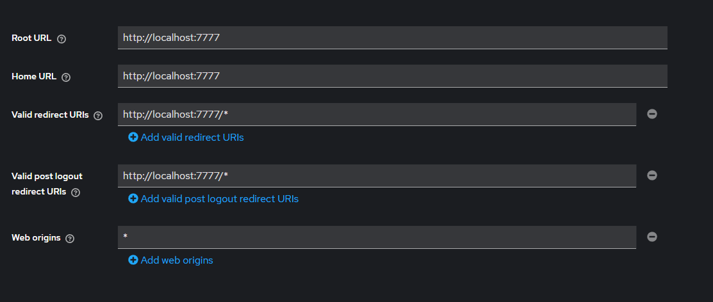
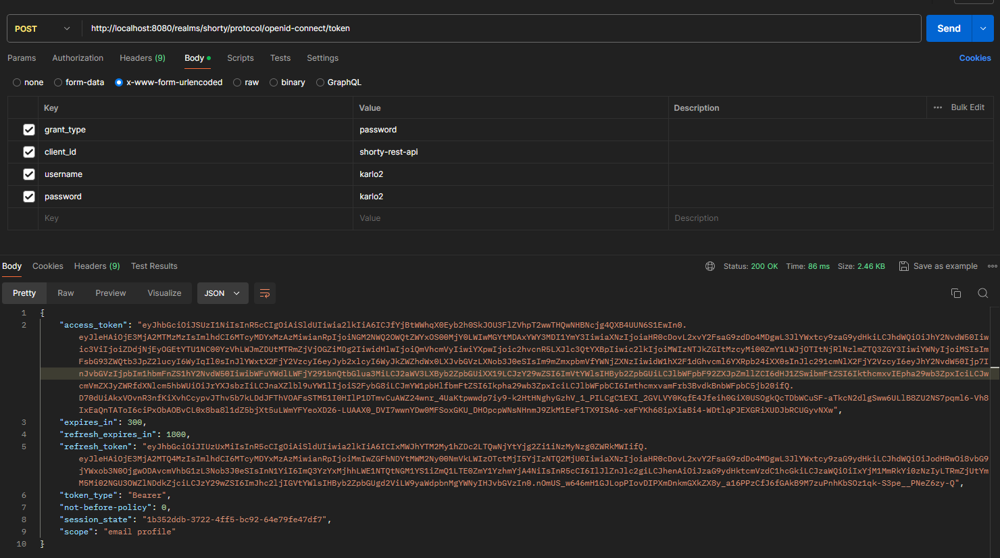

# Docker env setup

1. ***otvoriti docker hub, te runnati sljedeće komande kroz konzolu unutar direktorija projekta kako bi se projekt otvorio***
   1.      docker build -t shorty-image .
   2.      docker volume create --name keycloak-db-volume
   3.      docker-compose up -d backend_app_db backend_app keycloak keycloak_db

2. ***Runnanje testova se može odraditi kroz sljedeću komandu:***
   1.      docker-compose run backend_test

3. ***Nakon što se projekt otvorio treba setupati keycloak realm i clienta (prilikom prvog setupa)***
   1.     Treba otići na web preglednik i otići na link: http://localhost:8080/admin
   2.     Ulogiraj se kao username: admin, password: admin
   3.     Tamo gdje piše master ili Keycloak za realm, otvori i odi na Create New Realm te stvori realm koji se zove: shorty
   4.     Odi na Clients, create new Client:
      1.        client-id i name(optional): shorty-rest-api 
      2.        u drugom koraku ostaviti sve po defaultu
      3.        sljedeći korak popuniti kao na slici 1. samo umjesto 7777 staviti 8000 (ili ako je promijenjen port aplikacije onda taj port)
      4.        zatim treba otići pod Roles i dodati rolu: client_developer (u slučaju da se treba accessati swagger)
   5.     Odi na Users, create new User:
      1.        stavi email verified na true te popuni sva polja (inace ce reci da user nije dovrsen) i stisni na create
      2.        odi na credentials, set password, i tu je bitno da je temporary off, password bilo koji staviti
      3.        zatim ako si dodao client_developer, odi na role mapping i stisni na assign role te assignaj client_developer rolu

4. ***Na kraju, user se logina kroz postman preko sljedećeg requesta, detalji su na Slici 2.***

***Slika 1***

***Slika 2***

# Projekt je spreman za rad :)